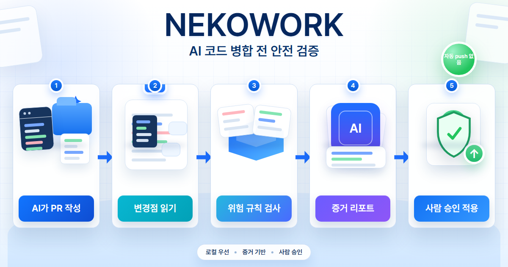

# NEKOWORK

[English](README.md) | [한국어](README.ko.md)

**AI가 만든 코드를 프로젝트에 넣기 전에 한 번 더 확인합니다.**

NEKOWORK는 Cursor, Claude Code, Codex 같은 AI 코딩 도구가 만든 변경을 위한
로컬 안전 검사 도구입니다. 무엇이 바뀌었는지 보고, 위험한 부분을 짚어주고,
결과를 **통과**, **검토 필요**, **차단**처럼 쉽게 알려줍니다.

NEKOWORK가 대신 코드를 작성하지는 않습니다. 스스로 커밋하거나 push하거나 병합하거나
배포하지도 않습니다. **최종 결정은 항상 사람이 합니다.**

[](https://github.com/Ps-Neko/NEKOWORK/actions/workflows/harness-validate.yml)
[](https://www.npmjs.com/package/@ps-neko/nekowork)
[](LICENSE)
[](#상태--공개-알파)

<p align="center">
  
  <br/>
  <a href="https://ps-neko.github.io/NEKOWORK/?fixture=sample-pr-001"><strong>라이브 데모 열기</strong></a>
</p>

## 1분 요약

AI 코딩 도구는 빠르지만, 가끔 위험한 변경을 남깁니다. 예를 들면 코드 안에 들어간
시크릿 키, 꺼져버린 테스트, 위험한 설치 스크립트, 충분한 검토 없이 push하려는 자동화
같은 것들입니다.

NEKOWORK는 AI가 파일을 바꾼 뒤, 그 변경이 프로젝트에 들어가기 전에 거치는 추가
안전 검사입니다.

1. AI 도구가 파일을 바꿉니다.
2. NEKOWORK가 바뀐 줄을 검사합니다.
3. NEKOWORK가 증거 리포트를 남깁니다.
4. 사람이 안전한지 보고 결정합니다.

비개발자라면 이렇게 이해하면 됩니다. **AI가 초안을 만들고, NEKOWORK가 위험 신호를
확인하고, 사람이 최종 승인합니다.**

## 판정이 뜻하는 것

| 판정 | 의미 |
|---|---|
| **통과** | 막아야 할 위험을 찾지 못했습니다. |
| **검토 필요** | 사람이 한 번 더 봐야 합니다. |
| **차단** | 심각한 위험을 찾았고, 위치와 이유를 알려줍니다. |

> `verify-pr` 의 기계 판독용 출력은 다섯 가지 verdict — `ALLOW`, `ALLOW_WITH_WARNINGS`,
> `NEEDS_HUMAN_REVIEW`, `INSUFFICIENT_EVIDENCE`, `BLOCK` — 이며 위 세 가지(통과 / 검토 필요 / 차단)에
> 대응합니다. 매핑 표는 [빠른 시작](packages/nekowork-cli/docs/QUICKSTART.md#3-the-five-verdicts-and-the-simple-buckets) 참고.

## 빠른 시작

요구사항: Node.js 22+, npm, 그리고 커밋이 하나 이상 있는 git 저장소.

```bash
# AI 도구가 파일을 바꾼 뒤:
npx -y @ps-neko/nekowork@alpha check
npx -y @ps-neko/nekowork@alpha verify-pr
```

> 항상 **`@alpha`** 태그를 쓰세요 — 태그 없는 기본 / `latest` dist-tag 는 오래된
> `0.2.0-alpha.0`(규칙 5개, 의존성 0개)에 고정돼 있습니다. `@alpha`(`0.2.0-alpha.7`)는
> **11개 규칙 전부**를 담고 있으니 `@alpha` 를 설치하면 됩니다.

NEKOWORK가 바뀐 줄을 읽고, 사람이 읽기 쉬운 `REPORT.md`를 만들고, 이 변경을
진행해도 되는지 알려줍니다.

차단될 때의 예:

```text
=== verify-pr ===
  verdict        : BLOCK
  reason         : Hardcoded secret fallback detected (src/auth.ts:42)
  risk_level     : CRITICAL
  merge_allowed  : false
  apply_allowed  : false
```

## 무엇을 잡아주나

NEKOWORK는 **정해진 AI 유발 위험 패턴 집합** — 11개 결정적 규칙 — 을 표시하고,
나머지는 전부 사람의 결정으로 보냅니다. 이것은 **전수 보안 감사가 아닙니다**:

- 코드에 실수로 들어간 시크릿 키, 하드코딩된 인증정보, 임시(fallback) 비밀번호.
- 꺼져버린 테스트, lint, 보안 검사.
- 자동 커밋, 자동 push, 자동 병합, 자동 배포를 시도하는 코드.
- 위험한 패키지 변경이나 설치 스크립트(예: `postinstall` 훅).
- `eval` / 동적 코드 실행, 안전하지 않은 TLS, CORS 와일드카드.
- 기본적인 SQL / command injection 형태.
- 변수 매개 / 문장 간 injection(여러 문장에 걸쳐 조립된 SQL·셸 명령·`eval`)을 AST dataflow 분석으로 — 한 줄짜리 정규식만이 아니라.
- 안전하다고 믿기에는 증거가 부족한 변경.

결정적 판정, 사람 게이트, "스스로 push하지 않는다"는 약속은 위 항목 전부에 대해
유지됩니다. AST dataflow 룰은 **함수 내(intraprocedural)·보수적**입니다 — taint 를
**한 함수 안에서만** JS/TS 한정으로 따라가며, cross-function 이나 whole-program 분석은
하지 않습니다. 그 너머(대부분의 injection 부류, 비즈니스 로직 버그, 인가(authorization)
결함)는 여전히 **범위 밖**입니다. 정확한 경계는
[벤치마크의 "What is NOT covered"](packages/nekowork-cli/docs/BENCHMARK.md) 참고.

> 참고: 발행된 `@alpha`(0.2.0-alpha.7)는 이제 **11개 규칙 전부**(eval, 안전하지 않은 TLS,
> CORS 와일드카드, SQL/command injection, AST dataflow 포함)를 담고 있으며, AST 엔진을 위해
> **작고 잘 알려진 의존성 1개**(`acorn`, JS 파서 — MIT, transitive 의존성 0)를 추가합니다.
> 항상 **`@alpha`** 태그로 설치하세요 — `latest` dist-tag 는 오래된 `0.2.0-alpha.0`(규칙 5개,
> 의존성 0개)입니다.

전체 기술 범위: [SCOPE-1.0.md](packages/nekowork-cli/docs/SCOPE-1.0.md).

## NEKOWORK가 아닌 것

- IDE가 아닙니다.
- 또 하나의 AI 코딩 에이전트가 아닙니다.
- 스스로 코드를 push하는 자동 조종 도구가 아닙니다.
- Cursor, Claude Code, Codex의 대체품이 아닙니다. 먼저 그 도구들을 사용하고,
  그 결과를 NEKOWORK로 검사하세요.
- 테스트·계약 검증 도구(Hurl, `go test`)가 아닙니다 — 그건 동작이 올바른지 보고, NEKOWORK는 머지 전 diff 자체가 위험한지 봅니다.

## 검증만으로 부족할 때

NEKOWORK는 일부러 좁게 만들어졌습니다 — AI가 만든 변경을 병합 전에 검사하는
한 가지 일만 합니다. 같은 검증 철학을 더 큰 개발 흐름(문제 정리, 스펙, 계획,
작업 패킷, 워커 프롬프트, 그리고 같은 게이트) 안에 두고 싶다면,
[NEKOFORGE](https://github.com/Ps-Neko/NEKOFORGE)를 참고하세요 —
NEKOWORK식 게이트를 마지막 안전 단계로 흡수하는 소스 기반 AI 개발 하네스입니다.

```text
NEKOWORK  = AI 변경에 대한 좁은 안전 검사
NEKOFORGE = 전체 로컬 개발 하네스, 마지막에 같은 게이트로 끝남
```

## 상태 -- 공개 알파

NEKOWORK는 공개 알파 단계입니다. npm에 배포되어 있고, CI와
[라이브 데모](https://ps-neko.github.io/NEKOWORK/?fixture=sample-pr-001),
테스트 스위트가 있습니다.

솔직한 단서 하나: **"검증됨"은 증거가 기록된 독립 검토를 뜻합니다. 수학적으로
완벽하다는 뜻은 아닙니다.**

빈틈이나 잘못된 차단을 발견하셨다면
[알파 피드백을 남겨주세요](https://github.com/Ps-Neko/NEKOWORK/issues/new?template=alpha-feedback.yml)

## 문서

- **여기서 시작:** [Quickstart](packages/nekowork-cli/docs/QUICKSTART.md) | [검증 작동 방식](packages/nekowork-cli/docs/SCOPE-1.0.md) | [통합](packages/nekowork-cli/docs/INTEGRATION.md)
- **더 깊이:** [아키텍처](packages/nekowork-cli/docs/ARCHITECTURE.md) | [고급 명령](packages/nekowork-cli/docs/ADVANCED.md) | [비전](packages/nekowork-cli/docs/VISION.md)
- **기여:** [CONTRIBUTING.md](CONTRIBUTING.md) -- 영어 PR 환영.
- **라이선스:** MIT
