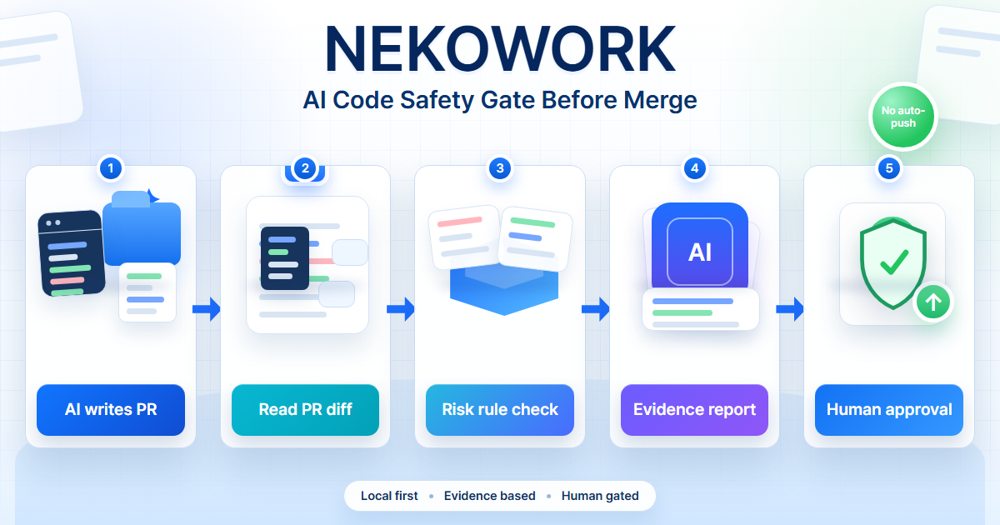

# NEKOWORK

[English](README.md) | [한국어](README.ko.md)

**Check AI-written code before it enters your project.**

NEKOWORK is a local safety checkpoint for code made by AI tools such as Cursor,
Claude Code, and Codex. It looks at what changed, points out risky parts, and
gives you a simple verdict: **PASS**, **REVIEW**, or **BLOCK**.

It does not write code for you. It does not commit, push, merge, or deploy by
itself. **A human still makes the final decision.**

[](https://github.com/Ps-Neko/NEKOWORK/actions/workflows/harness-validate.yml)
[](https://www.npmjs.com/package/@ps-neko/nekowork)
[](LICENSE)
[](#status--public-alpha)

<p align="center">
  
  <br/>
  <a href="https://ps-neko.github.io/NEKOWORK/?fixture=sample-pr-001"><strong>Open live demo</strong></a>
</p>

## In One Minute

AI coding tools are fast, but they can also leave dangerous changes behind:
secret keys in code, disabled tests, risky install scripts, or automation that
pushes code without enough review.

NEKOWORK is the extra checkpoint after the AI changes files and before the
change is accepted into your project.

1. Your AI tool changes the files.
2. NEKOWORK checks the changed lines.
3. NEKOWORK writes an evidence report.
4. You decide whether the change is safe.

If you are not a developer, the short version is: **AI makes the draft,
NEKOWORK checks the warning signs, and a person approves the final change.**

## What The Verdict Means

| Verdict | Meaning |
|---|---|
| **PASS** | No blocking risk was found. |
| **REVIEW** | Something needs a human look before moving on. |
| **BLOCK** | NEKOWORK found a serious risk and tells you where it is. |

> `verify-pr`'s machine-readable output uses five specific verdicts — `ALLOW`,
> `ALLOW_WITH_WARNINGS`, `NEEDS_HUMAN_REVIEW`, `INSUFFICIENT_EVIDENCE`, and `BLOCK` —
> that map onto these three buckets. See the
> [verdict table](packages/nekowork-cli/docs/QUICKSTART.md#3-the-five-verdicts-and-the-simple-buckets).

## Quickstart

Requirements: Node.js 22+, npm, and a git repository with at least one commit.

```bash
# after your AI tool changes some files:
npx -y @ps-neko/nekowork@alpha check
npx -y @ps-neko/nekowork@alpha verify-pr
```

> Always use the **`@alpha`** tag — the bare package / `latest` dist-tag is pinned
> to a stale `0.2.0-alpha.0` (5 rules, zero deps). `@alpha` (`0.2.0-alpha.8`) ships
> the full **11 rules**, so `@alpha` is the one to install.

NEKOWORK reads the changed lines, writes a plain-English `REPORT.md`, and tells
you whether the change should move forward.

Example when a change is blocked:

```text
=== verify-pr ===
  verdict        : BLOCK
  reason         : Hardcoded secret fallback detected (src/auth.ts:42)
  risk_level     : CRITICAL
  merge_allowed  : false
  apply_allowed  : false
```

## What It Catches

NEKOWORK flags a **defined set of AI-introduced risk patterns** — 11 deterministic
rules — and routes everything else to a human decision. It is **not an exhaustive
security audit**:

> Note: the published `@alpha` (0.2.0-alpha.8) now ships all **11 rules** (incl. eval,
> insecure TLS, CORS wildcard, SQL/command injection, and AST dataflow) and adds **one
> tiny, well-known dependency** (`acorn`, the JS parser — MIT, zero transitive
> dependencies) for the AST engine. Always install with the **`@alpha`** tag: the
> `latest` dist-tag is a stale `0.2.0-alpha.0` (5 rules, zero deps).

- Secret keys, hardcoded credentials, or fallback passwords accidentally placed in code.
- Tests, lint checks, or security checks being switched off.
- Code that tries to auto-commit, auto-push, auto-merge, or deploy.
- Risky package or install-script changes (e.g. `postinstall` hooks).
- `eval` / dynamic code execution, insecure TLS, CORS wildcards.
- Basic SQL / command injection shapes.
- Variable-mediated / cross-statement injection (assembled SQL, shell commands, `eval`) via AST dataflow analysis — not just single-line regex.
- Changes with too little evidence to trust safely.

The deterministic verdict, the human gate, and the "never auto-pushes" promise hold
for everything above. The AST dataflow rule is **intraprocedural and conservative**:
it follows tainted values **within a single function** and JS/TS only — it does **not**
do cross-function or whole-program analysis. Anything beyond that (most injection
classes, business-logic bugs, auth/authorization flaws) is still **out of scope**. See
the [benchmark's "What is NOT covered"](packages/nekowork-cli/docs/BENCHMARK.md) for the
exact boundary.

Full technical scope: [SCOPE-1.0.md](packages/nekowork-cli/docs/SCOPE-1.0.md).

## What NEKOWORK Is Not

- Not an IDE.
- Not another AI coding agent.
- Not an autopilot that pushes code on its own.
- Not a replacement for Cursor, Claude Code, or Codex. Use those tools first,
  then run their output through NEKOWORK.
- Not a test or contract-testing tool (Hurl, `go test`) — those check whether behavior is correct; NEKOWORK checks whether the diff itself is risky before merge.

## Need More Than Verification?

NEKOWORK is intentionally narrow: it only verifies AI-written changes before
merge. If you want the same verification philosophy embedded in a fuller
development workflow -- problem framing, spec, plan, work packets, worker
prompts, and then the same gate -- see
[NEKOFORGE](https://github.com/Ps-Neko/NEKOFORGE), the source-based AI
development harness that wraps the NEKOWORK-style gate as its final safety
step.

```text
NEKOWORK  = narrow safety checkpoint on AI-written changes
NEKOFORGE = full local development harness; ends with the same gate
```

## Status -- Public Alpha

NEKOWORK is in public alpha. It is already published on npm, has CI coverage, a
[live demo](https://ps-neko.github.io/NEKOWORK/?fixture=sample-pr-001), and a
test suite.

One honest note: **"verified" means independently checked with recorded
evidence. It does not mean mathematically proven correct.**

Found a gap or a false block?
[Open alpha feedback](https://github.com/Ps-Neko/NEKOWORK/issues/new?template=alpha-feedback.yml)

## Docs

- **Start here:** [Quickstart](packages/nekowork-cli/docs/QUICKSTART.md) | [How verification works](packages/nekowork-cli/docs/SCOPE-1.0.md) | [Integration](packages/nekowork-cli/docs/INTEGRATION.md)
- **Go deeper:** [Architecture](packages/nekowork-cli/docs/ARCHITECTURE.md) | [Advanced commands](packages/nekowork-cli/docs/ADVANCED.md) | [Vision](packages/nekowork-cli/docs/VISION.md)
- **Contributing:** [CONTRIBUTING.md](CONTRIBUTING.md) -- English PRs welcome.
- **License:** MIT
