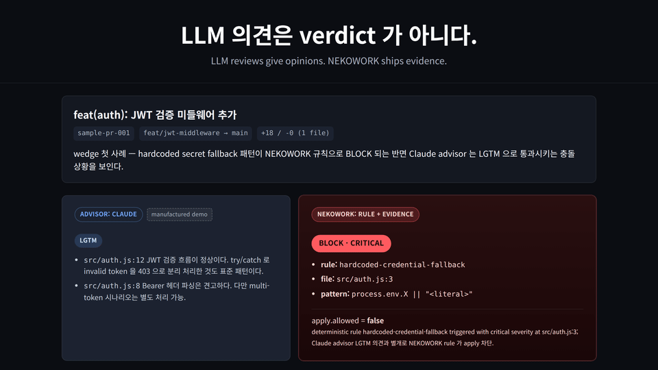
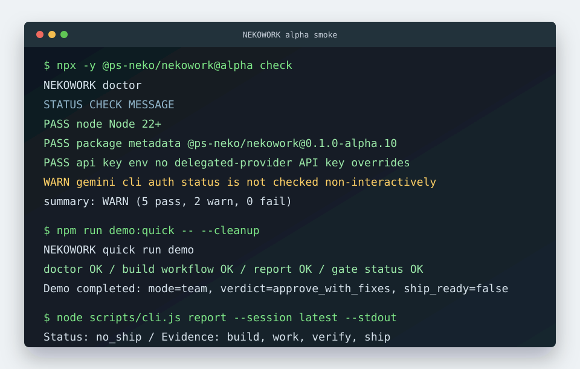

# NEKOWORK

[English](README.md) | [한국어](README.ko.md)

**Don't merge AI code without verification.**

[](https://github.com/Ps-Neko/NEKOWORK/actions/workflows/harness-validate.yml)

<p align="center">
  <a href="https://ps-neko.github.io/NEKOWORK/?fixture=sample-pr-001">
    
  </a>
  <br/>
  <em>Claude said LGTM. NEKOWORK blocked.</em> &nbsp;·&nbsp; <a href="https://ps-neko.github.io/NEKOWORK/?fixture=sample-pr-001"><strong>Live demo →</strong></a>
</p>

NEKOWORK is a local verification gate for AI-generated code. It analyzes the diff, runs deterministic risk rules, collects evidence, and decides whether the change is safe to merge or apply — without auto-committing, auto-pushing, or trusting LLM verdicts.

Note: "Verified" means independently reviewed with recorded evidence — not mathematically proven correct. The verdict is decided by deterministic rules and check results. Optional Codex review is recorded as an advisor note only and never controls the verdict.

> 1.0 scope and roadmap: [docs/SCOPE-1.0.md](docs/SCOPE-1.0.md). Long-term vision (Verification-first AI development factory): [docs/VISION.md](docs/VISION.md).

Note: "ship" in NEKOWORK is a **readiness decision** (`SHIP_READY` or `NO_SHIP`), not a deployment. The `ship` step decides whether `apply` is allowed; it never commits, pushes, deploys, or publishes by itself.

Default path:

```bash
npx -y @ps-neko/nekowork@alpha check
npx -y @ps-neko/nekowork@alpha verify-pr
cat REPORT.md
cat .nekowork/decision.json
```

Every real `verify-pr` run puts the verdict first:

```text
=== verify-pr ===
  verdict        : BLOCK
  reason         : Hardcoded secret fallback detected (src/auth.ts:4)
  risk_level     : CRITICAL
  merge_allowed  : false
  apply_allowed  : false
```

The machine-readable companion `decision.json` and the full report are in [Example Report](#example-report).

The evidence chain is intentionally narrow:

```text
diff -> deterministic risk rules -> checks (test/lint/typecheck; detected always, executed with --run-checks, escalation-only) -> evidence package -> deterministic decision -> REPORT.md -> Human Gate -> explicit apply
```

No auto-commit. No auto-push. No surprise deploy. `apply` is explicit; it requires a `decision.json` whose `apply_allowed` is `true`.

Bring your AI tool (Cursor / Claude Code / Codex). NEKOWORK starts after the diff is on disk. Advanced and legacy commands are documented in [docs/ADVANCED.md](docs/ADVANCED.md) and gated under Phased Cut (see [docs/SCOPE-1.0.md](docs/SCOPE-1.0.md)).

**Public alpha evidence:** 532 tests / 5/5 rules pass 1.0 gate on a synthetic+OSS+live-AI corpus ([benchmark](docs/BENCHMARK.md)) / 0 moderate+ npm audit issues / fresh `npx @alpha` smoke / 10 case-study flows / 5 starter packs · [CI badge](https://github.com/Ps-Neko/NEKOWORK/actions/workflows/harness-validate.yml) · [npm package](https://www.npmjs.com/package/@ps-neko/nekowork) · [terminal transcript](docs/DEMO.md#one-minute-terminal-transcript) · [full report example](docs/DEMO-REPORT.md) · [external run kit](docs/EXTERNAL-RUN.md) · [alpha feedback](https://github.com/Ps-Neko/NEKOWORK/issues/new?template=alpha-feedback.yml) · [roadmap](docs/ROADMAP.md)



## One Command. One Blocked Risk.

After your AI tool (Cursor / Claude Code / Codex) writes a `process.env.X || "fallback"` into your auth code, run:

```bash
npx -y @ps-neko/nekowork@alpha verify-pr
```

Typical blocked-risk output:

```text
=== verify-pr ===
  verdict        : BLOCK
  reason         : Hardcoded secret fallback detected (src/auth.ts:4)
  risk_level     : CRITICAL
  merge_allowed  : false
  apply_allowed  : false
  changed_files  : 1 (+3 -1)
  findings       : critical=1 high=0 medium=0 low=0
  top findings:
    - [CRITICAL] Hardcoded secret fallback detected (src/auth.ts:4)
```

That is the thesis: AI can write the change, but `verify-pr` runs deterministic rules over the diff and refuses to let unverified changes merge or apply.

## 30-Second First Run

Requirements: Node.js 22+, npm, and git. A git repo with at least one commit.

```bash
npx -y @ps-neko/nekowork@alpha check
npx -y @ps-neko/nekowork@alpha verify-pr
cat REPORT.md
cat .nekowork/decision.json
```

`check` confirms the environment is ready. `verify-pr` scans the current working tree diff with deterministic risk rules, writes evidence to `.nekowork/evidence/`, and decides whether the change is safe to merge or apply. It writes `REPORT.md` at the project root and `.nekowork/decision.json`.

Source checkout for local development:

```bash
node scripts/cli.js check
node scripts/cli.js verify-pr
```

> **Reproducibility note:** `npx @ps-neko/nekowork@alpha` resolves to the most recently published alpha. The published alpha may lag behind `main`. Pin an exact version (e.g. `@ps-neko/nekowork@0.1.0-alpha.12`) for reproducible behavior.

Compatibility / legacy commands (`cockpit`, `start`, `ask`, `plan`, `team`, `work`, `verify`, `gate`, `ship`, `run`, `build`, `auto`, `pr-prep`, `report --session`, `apply --session`, `review`) are documented in [docs/ADVANCED.md](docs/ADVANCED.md). They are scheduled for deprecation in 2.0 per [SCOPE-1.0.md](docs/SCOPE-1.0.md).

## Works With Your Existing AI Workflow

Use any AI coding tool (Claude Code, Cursor, Codex, ...) to create the diff. NEKOWORK starts after: risk scan, Codex verification, `decision.json`, Human Gate, and explicit apply. Optional upstream files (`context.md` / `DOMAIN.md` / `SPEC.md` / `PLAN.md`) are auto-picked from the project root — full contract in [docs/INTEGRATION.md](docs/INTEGRATION.md). Tools that produce those files (brainstorming, office-hours, DDD passes, writing-plans, etc.) are cataloged in [docs/UPSTREAM-RECIPES.md](docs/UPSTREAM-RECIPES.md).

## Example Report

`verify-pr` writes a human-readable `REPORT.md` at the project root and a machine-readable `.nekowork/decision.json`. Both come from the same deterministic decision — there is no LLM verdict in the chain.

`REPORT.md` (BLOCK on a secret fallback):

```text
# NEKOWORK Verification Report

## Verdict

**BLOCK**

## Reason

Hardcoded secret fallback detected (src/auth.ts:4)

## Decision

- merge_allowed: false
- apply_allowed: false
- risk_level: CRITICAL

## Changed Files

- total: 1
- additions: 3
- deletions: 1
- source: src/auth.ts

## Blocking Findings

- **CRITICAL** [secret-fallback] Hardcoded secret fallback detected — `src/auth.ts:4`
  - Read the secret from the environment and fail closed when it is missing.

## Evidence

- `.nekowork/evidence/risk-findings.json`
- `.nekowork/evidence/diff.summary.json`
- `.nekowork/evidence/evidence-manifest.json`
- `.nekowork/decision.json`

## Checks Available

- test: configured
- lint: configured
- typecheck: not configured
- build: not configured
- audit: configured
```

The verdict is the first line; everything under it is the evidence that produced it — the deterministic decision, the changed-file classification, the blocking findings, and the evidence paths. With `--run-checks`, a `## Checks Run` section replaces `## Checks Available` and lists each command's pass/fail.

The machine-readable companion is `.nekowork/decision.json` (`schema_version: verify-pr-v0`). Core fields below; `generated_at`, `project`, and the full `findings[]` array are elided for brevity:

```json
{
  "schema_version": "verify-pr-v0",
  "verdict": "BLOCK",
  "reason": "Hardcoded secret fallback detected (src/auth.ts:4)",
  "merge_allowed": false,
  "apply_allowed": false,
  "risk_level": "CRITICAL",
  "finding_counts": { "critical": 1, "high": 0, "medium": 0, "low": 0 },
  "changed_files": { "total": 1, "additions": 3, "deletions": 1, "source": ["src/auth.ts"] },
  "checks": { "requested": false, "skippedReason": null, "results": [] }
}
```

`apply` refuses to run unless `decision.json.apply_allowed` is `true`. See the full report contract and example artifact in [docs/DEMO-REPORT.md](docs/DEMO-REPORT.md), and the one-minute terminal transcript in [docs/DEMO.md](docs/DEMO.md).

## Main Surface

**1.0 front surface — start here:**

- `check` — local readiness probe
- `verify-pr` — verify a diff / PR against deterministic risk rules; writes `REPORT.md` and `.nekowork/decision.json`
- `verify-pr --comment-file <path>` — emit GitHub PR comment markdown for CI integration
- `verify-pr --ci-exit-soft` — treat `NEEDS_HUMAN_REVIEW` / `INSUFFICIENT_EVIDENCE` as exit 0 (label-driven CI)
- `verify-pr --include <path>` — force-scan a gitignored path (codegen / build output) that `git diff` would otherwise skip (repeatable)

The CI exit code matrix is fixed:

```text
ALLOW                  = 0
ALLOW_WITH_WARNINGS    = 0
NEEDS_HUMAN_REVIEW     = 1
INSUFFICIENT_EVIDENCE  = 1
BLOCK                  = 2
```

GitHub Actions example: [docs/examples/github-actions-verify-pr.yml](docs/examples/github-actions-verify-pr.yml).

**Compatibility / labs — scheduled for deprecation in 2.0:**

- Session-based gate: `start` / `report --session` / `apply --session` / `gate status` / `ship --session`
- Decomposed authoring: `ask` / `plan` / `team` / `work` / `verify` / `pr-prep`
- Wrappers: `build` / `auto` / `run`
- Legacy alias: `review` / `review-cycle` / `harness` binary

These commands are functional in alpha and documented in [docs/ADVANCED.md](docs/ADVANCED.md). They will get `[deprecated]` labels in 0.3.x and be removed in 2.0 per [docs/SCOPE-1.0.md](docs/SCOPE-1.0.md). Pure 1.0 users should not need them.

Stage contract for legacy commands: [docs/CLI-STAGES.md](docs/CLI-STAGES.md). Build modes: [docs/BUILD.md](docs/BUILD.md). Bounded autonomy: [docs/AUTONOMY.md](docs/AUTONOMY.md). Advanced runtime (`ralph`, `wait`, instincts, cost tracking, Rust supervisor): [docs/ADVANCED.md](docs/ADVANCED.md).

## Starter Packs

Five public packs. Discovery and install in [docs/CATALOG-PACKS.md](docs/CATALOG-PACKS.md).

| Pack | Adds | Use when |
|---|---|---|
| `core` | minimal verification runtime | first install or repo smoke |
| `builder` | safe build modes entrypoint | one-command build with verification and gates |
| `productivity` | planning, TDD, debugging, finish routines | daily AI-assisted development |
| `security` | auth/secrets/deploy risk prompts | sensitive changes |
| `release` | ship/no-ship evidence | pre-release checks |

## Why NEKOWORK

NEKOWORK is for teams that want AI-assisted development without making the agent catalog the product. The default path keeps local auth, inspectable handoffs, single-executor writes, independent Codex verification, and Human Gate decisions in front of risky ship/apply steps.

NEKOWORK packages one source catalog, `agent.yaml`, projected into Claude Code, Codex CLI, Cursor, Gemini CLI, and OpenCode surfaces.

NEKOWORK is intentionally not a 100-agent pack. Every agent, skill, hook, profile, module, and pack must improve verification, preserve one-executor writes, produce auditable evidence, and respect Human Gate. Advanced autonomy, parallel candidates, PR prep, and agentic harness patterns are documented after the quickstart because they are optional.

For comparison and positioning: [docs/WHY-NEKOWORK.md](docs/WHY-NEKOWORK.md).

## Status

Current repository version: `0.1.0-alpha.12` · Current npm alpha: `@ps-neko/nekowork@0.1.0-alpha.12` (published 2026-05-26, `@alpha` dist-tag). Package: `@ps-neko/nekowork`. CLI: `nekowork` (`harness` is a legacy alias). Default: mock providers, no API keys.

Verification: `npm run lint` pass · `npm test` 532 tests pass · `npm audit --audit-level=moderate` 0 vulns · `npm pack --dry-run --json` pass · `npx -y @ps-neko/nekowork@alpha check` pass with warnings only.

Live provider auth delegates to local CLI sessions (`claude auth status`, `codex login`, `gemini`); long-lived API key env vars (`ANTHROPIC_API_KEY`, `OPENAI_API_KEY`, `GEMINI_API_KEY`, `GOOGLE_API_KEY`) are blocked unless `HARNESS_AUTH_ALLOW_ENV_OVERRIDE=1`. See [docs/SETUP.md](docs/SETUP.md).

## Documentation

- **Core:** [QUICKSTART](docs/QUICKSTART.md) · [CLI-STAGES](docs/CLI-STAGES.md) · [INTEGRATION](docs/INTEGRATION.md) · [UPSTREAM-RECIPES](docs/UPSTREAM-RECIPES.md) · [BUILD](docs/BUILD.md) · [AUTONOMY](docs/AUTONOMY.md) · [SAFETY-GUARANTEES](docs/SAFETY-GUARANTEES.md) · [FAILURE-MODES](docs/FAILURE-MODES.md)
- **Demos & evidence:** [DEMO](docs/DEMO.md) · [DEMO-REPORT](docs/DEMO-REPORT.md) · [EXTERNAL-RUN](docs/EXTERNAL-RUN.md) · [case-studies](docs/case-studies)
- **1.0 direction:** [SCOPE-1.0.md](docs/SCOPE-1.0.md) — scope, risk rules, decision policy, fixture sourcing · [VISION.md](docs/VISION.md) — long-term verification-first OS vision
- **Reference:** [GUIDED-MODE](docs/GUIDED-MODE.md) · [ADVANCED](docs/ADVANCED.md) · [CATALOG-PACKS](docs/CATALOG-PACKS.md) · [PORTING](docs/PORTING.md) · [PR-PREP](docs/PR-PREP.md) · [RELEASE-READINESS](docs/RELEASE-READINESS.md) · [ARCHITECTURE](docs/ARCHITECTURE.md) · [PRODUCT-PRINCIPLES](docs/PRODUCT-PRINCIPLES.md) · [ROADMAP](docs/ROADMAP.md)
- **Project rules:** [SOUL.md](SOUL.md) · [RULES.md](RULES.md) · [AGENTS.md](AGENTS.md)

## License

MIT
